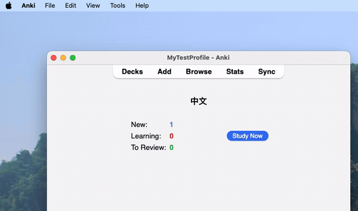
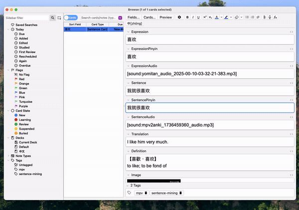
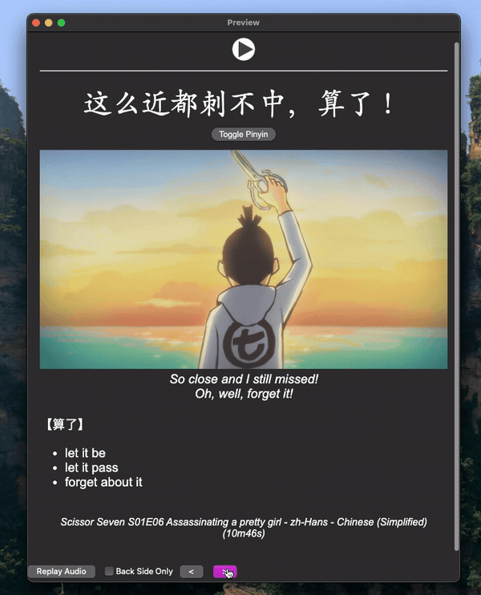

<h1 style="font-family: monospace;">Hanzi2Pinyin - Quick Start Guide</h1>

### 1. Import [THIS](https://github.com/alyssabedard/Hanzi2Pinyin-notetype) note type
For proper display of Hanzi with Pinyin/Zhuyin (ruby text), you'll need to import [this](https://github.com/alyssabedard/Hanzi2Pinyin-notetype)
Anki note type. 
When imported, you'll find two example cards demonstrating the functionality.

### 2. Optional - Change the phonetics
Zhuyin or Pinyin (Pinyin by default).

### 3. Add your chinese text inside `SentencePinyin` and click the `中[zhōng]` button
⚠️ The Note type will read the Ruby characters from the `SentencePinyin` field.

### 4. Voilà 

